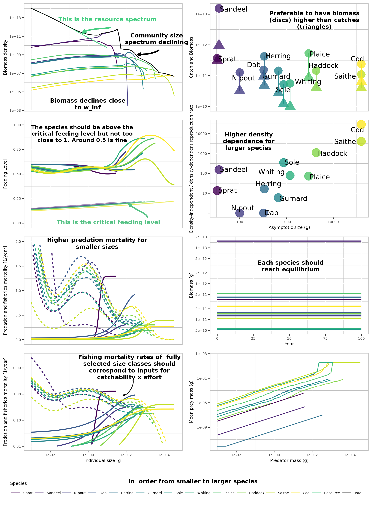

```{r set up, message = F,include=FALSE}
source("../utility.R")
```


# Beginner level tutorial - how to parameterise a Mizer model

In this tutorial you will learn 

- What type of data is needed to parametrise a Mizer model

- How to convert raw data into a `mizerParams` object

- Check the several assumptions you are making about your parameters

- Explore the model for the first time with your own data set


## Step 1 - What data are typically needed to parameterise a mizer model?

![Figure 1: Illustration of the parameters needed (blue boxes) and calibrated (green boxes) by Mizer. The need for data is hierarchical: a model can be setup and calibrated with the information in red: knowledge of the asymptotic size and observations of biomass and fishing. The calibration can be refined by adding further information in life history parameters and by using knowledge of Fmsy to calibrate the reproductive efficiency (orange). Additional refinement can be done by specifying the interaction matrix, theta (blue). Other parameters can be adjusted but they are rarely known accurately on a species-by-species basis (black).](../paper/parameterSketch.png)

Parameter description table:

w_inf: asymptotic size

w_mat: maturation size (determines when 50% of the population has matured / not sure!)

beta: preferred predator/prey mass ratio

sigma: width of the feeding kernel

R_max: Beverton-Holt density dependence parameter

k_vb: von Bertalanffy growth parameter

l25: length at 25% catch

l50: length at 50% catch

a: coefficient for age to size conversion

b: constant for age to size conversion

catchability: fisheries efficiency

h: maximum intake rate

k: metabolism constant

ks: metabolism coefficient

z0: background mortality coefficient

gamma: search volume (obtained from beta and sigma)

w_mat25: weight at which 25% of individuals are mature

erepro: coefficent that weights reproductive output


The multispecies model in mizer allows you to resolve species-specific differences in life history and feeding parameters that are important for modelling particular ecosystems.

Let's start with the minimal amount of information neede to run a mizer model.

First you are going to need a data frame of species specfic parameters to input into the `newMultispeciesParams()` function. This function requires at least three columns of parameters:

- species name (`species`)
- asymptotic weight (`w_inf`)
- maximum intake rate (`h`) or von Bertalanffy growth parameter (`k_vb`)

TODO: what is `w_inf` and what is VB

The data frame is arranged as species by parameter, so each column of the parameter data frame is a parameter and each row has the values of the parameters for one of the species in the model.

You will also need an interaction matrix that defines the overlapping interaction between each species (default is set to 1, meaning full availability of each predator and prey species). 

All other parameters either have default values or will be calculated from the supplied parameters.

Let's start with a small made up example assuming we have already found some parameters from FishBase or the literature.

Here we consider two interacting species and a background resource spectrum (we will come back to this). Using the North Sea as an example, let's start with the iconic Atlantic Cod and a key local prey species Sandeel.

Remember to minimally set up this model we can look on Fishbase (www.fishbase.se or use the `rfishbase` package) to find the aymptotic weights of these two species.

A search on fishbase reveals some parameters from empirical von Bertalanffy growth curves which can be used to set up the life history parameters - `w_inf` and `k_vb`. 

Often von Bertalanffy relationships are based on length not weight and the length parameters can be converted to weight using length-weight regressions. Each species has a slightly different regression relationship which uses 2 parameters (usually called "a" and "b") and is based on the following formula:

TODO weight-size relationship equation here


We find an asymptotic length of 132 cm and k of 0.2 for cod in the North Sea here:https://www.fishbase.se/popdyn/PopGrowthList.php?ID=69&GenusName=Gadus&SpeciesName=morhua&fc=183

And for sandeel, 18.5 cm and k_vb=0.4 

https://www.fishbase.se/popdyn/PopGrowthList.php?ID=37&GenusName=Ammodytes&SpeciesName=marinus&fc=402

We then need to convert these asymptotic lengths to weights using length-weight regression parameters, which also can be found on fishbase or in the literature.

For cod: 

https://www.fishbase.se/popdyn/LWRelationshipList.php?ID=69&GenusName=Gadus&SpeciesName=morhua&fc=183

this estimates a w_inf = 24600 g

For sandeel:
https://www.fishbase.se/popdyn/LWRelationshipList.php?ID=37&GenusName=Ammodytes&SpeciesName=marinus&fc=402

this estimates a w_inf = 22.83 g 

If `w_inf` or `l_inf` are not available you could use maximum observed sizes, these values are often systematically larger than estimates of asymptotic weight, and we recommend you check the literature or size-at-age data for your system to check reliability of fishbase estimates.

We also know from the literature that the preferred predator-prey mass ratio for Cod is approximately 100 and we might guess that it is approximately 10000 for Sandeel as they feed on prey much smaller than themselves. This means that cods of any given size are 100 times larger than their preferred prey size and sandeels are 10000 larger than theirs.

For simplicity, we will assume defaults for all other parameters and that both species occur in the same environmenta throughout their lives (interaction matrix = 1).


```{r step 1 - small example}
smallExample <- data.frame("species" = c("sandeel","cod"),"w_inf" = c(23,24600), "k_vb" = c(0.1,0.2),"beta" = c(10000,100))
smallExample
smallInter <- matrix(c(1,1,1,1),ncol = 2, dimnames = list(smallExample$species,smallExample$species))
smallInter
```

The 'smallExample' shows the format of the data.frame for the species parameters and the 'smallInter' shows the format of the interaction matrix. Both of these are required as inputs for creating a "mizerParams" object. Many mizer users will collect this information in a spreadsheet prior to reading in the data into mizer. 

To illustrate this next step we will use pre-existing  set of species' specific parameters for a previously published  North Sea model, that used more detailed fisheries dependent and independent data to calculate species parameters. 

These files are availalble in the "How to Mizer" GitHub repository as shown below.


```{r step 0 - initial parameters, message= F }

# loading North Sea species parameters
nsParams <- read.csv("../data/nsparams0.csv")
inter <- read.csv("../data/inter.csv")
inter<- data.matrix(inter[-1])
rownames(inter) =nsParams$species


# more information on how to set this up is here:
#https://sizespectrum.org/mizer/articles/a_multispecies_model_of_the_north_sea.html

nsParams 

inter


```


The second type of data you are going to need is a data set of catch and/or spawning stock biomass ($SSB$) of the selected species, so we can compare the model output's to real data. The fisheries time-series of the North Sea are also avaible in this repository. We will use these data later in our second tutorial on calibration.

Becasue the North Sea is heavily fished we also need information on fishing intensity and other parameters have been entered into the species parameter file that relate to the type of fishing gear selectivity ( which is assumed to be species-specific).

In mizer, fishing mortality rates at size for each gear are calculated as

F = catchability*selectivity*effort

The selectivity parameters are determined from l_25, l_50, and sel_func  but simpler appraches can also be used. See 
https://sizespectrum.org/mizer/reference/setFishing.html

For the North Sea we assumed catchability*effort could be estimated from the fishing moratlity rates of fully selected sizes/ages of fish from single-species stock assessments. The  following .csv are extracted from the ICES stock assessment database using "data/getICESFishdata_param.R". Fishing mortality data is averaged over 2014-2019 as it is a relatively stable period in catches and has the maximum amount of data across all species concerned.


** Note the species are not in the right order here, but we can fix that later...


```{r step 1 - loading data}

# fisheries mortality F
fMat <- read.csv("../data/fmat.csv")
# fMatWeighted <- read.csv("data/fmatWeighted.csv") # Sandeel and Cod have multiple data base so average their F and weighting by SSB
fMatWeighted <- readRDS("../data/FmatWeightedInterpolated.rds") # to get Gurnard data


# read in time-averaged  catches  
catchAvg <-read.csv("../data/time-averaged-catches.csv") # only that one is used at the moment | catches are estimated from fMatW

# ssb
ssbAvg <- read.csv("../data/time-averaged-SSB.csv")

```


## Step 2 - How to convert the data into a valid `mizerParams` object


In this section you will:

- learn to format raw data into a Mizer compatible format

Inputing the previous data frame and interaction matrix into the `newMultispeciesParams()` function output a fully fleshed `mizerParams` object


```{r step 2 - mizerParams example}
param <- newMultispeciesParams(smallExample,smallInter)
param@species_params
```

You can see that mizer has estimated several missing parameters. [Go through each of these, take a look atthe above figure again]


Let's do the same for our North Sea data set and look at what parameters we can find in the `mizerParams` object:


```{r step 2 - mizerParams NS}

params_uncalibrated <- newMultispeciesParams(nsParams, inter, kappa = 1e11, max_w=1e6) # inter comes with loading "mizer"

params_uncalibrated@species_params$erepro <- .01 # default is 1

# note the volume of this model is set to the reflect the entire volume of the North Sea - hence the very large kappa value. This is system specific and you may wnat to work with per m^3 as in the defaults.

#  Add other params for info
#  param$Volumecubicmetres=5.5e13    #unit of volume. Here total volume of North sea is used (Andersen & Ursin 1977)

# have a look at species parameters that have been calculated
# params_uncalibrated@species_params

# alternative params without redundant parameters to reduce the size of the dataframe on the screeen
params_uncalibrated@species_params[,-which(colnames(params_uncalibrated@species_params) %in% 
                                             c("sel_func","gear","interaction_resource","pred_kernel_type","m","alpha","n","p","q","w_min"))]

# TODO Reduce further the number of parameters on the screen (maybe just show 2 species) and add descritpion below

```


## Step 3 - Running and exploring the model for the first time to check coexistence (e.g. first guess)

In this section you will:

- Try to get coexistence between your species manually

First, let's use the `project()` function with our `mizerParams` object to project in time our initial ecosystem and see if species manage to coexist together. 


```{r step 3 - first run, message=F, warning = F}

# run with fishing
sim_uncalibrated <- project(params_uncalibrated, t_max = 100, effort = 1)

plotSummary(sim_uncalibrated, short = T)

```

 JB - note error in plotSummary long =T - why?

The top panel shows the different species size spectrum at the last time step of the simulation while the bottom panel shows the abundance per species through time.

These plots show that species do not coexist and several go extinct. This is because there was no external density dependence ($R_{max}$ is set at $Inf$) and the largest species (Cod and Saithe) are out-competing the rest.


To get coexistence one needs to guess reasonable $R_{max}$ values which will stop out-competition from a few species. We assume that a the density dependence is going to be posively related to body size, meaning that large individuals will have a stronger density-dependence applied to them (and therefore a lower $R_{max}$ value)

TODO explain Rmax here


```{r step 3 - guessing coexistence, warning=F, message=F}

# let's start again and replace with the initial pre-calibration "guessed" Rmax 
params_guessed <- params_uncalibrated
# penalise the large species with higher density dependence
params_guessed@species_params$R_max <- params_guessed@resource_params$kappa*params_guessed@species_params$w_inf^-1
# and reduce erepro
# params_guessed@species_params$erepro <- 1e-3

params_guessed <- setParams(params_guessed)
# run with fishing
sim_guessed <- project(params_guessed, t_max = 100, effort =1)
plotSummary(sim_guessed, short = T)
saveRDS(sim_guessed, "HTM1_sim.rds")


```

The ecosystem looks way better. Saithe's largest individuals are having a hard time, but at least species coexist.

$R_{max}$ affects the density-dependent reproduction rate ($RDD$) but limiting the maximum amout of spawn calculated from the density-independent reproduction rate ($RDI$). Let's look at the $RDD/RDI$ ratio to see how strong acts $R_{max}$ on our different species.


```{r step 3 - RDD/RDI}
#TODO update to last version, maybe make a function

  plot_dat <- as.data.frame(getRDD(sim_guessed@params)/getRDI(sim_guessed@params))
  plot_dat$species <- factor(rownames(plot_dat),sim_guessed@params@species_params$species)
  colnames(plot_dat)[1] <- "ratio"
  plot_dat$w_inf <- sim_guessed@params@species_params$w_inf


ggplot(plot_dat)+
  geom_point(aes(x = w_inf, y = ratio, color = species), size = 6, alpha = .8) +
  geom_text(aes(x = w_inf, y = ratio, label = species), hjust = 0, nudge_x = 0.05)+
  # geom_line(aes(x = w_inf, y = value, color = Species)) +
  scale_y_continuous(name = "density-independent / density-dependent reproduction rate", limits = c(0,1)) +
  scale_x_continuous(name = "Asymptotic size (g)", trans = "log10") +
  scale_color_manual(name = "Species", values = params_uncalibrated@linecolour) +
  theme(panel.background = element_blank(),
                   panel.grid.minor = element_line(color = "gray"),
       legend.position = "none")


```


Is the physiological recruitment, $RDI$, much higher than the realised recruitment, $RDD$? Low $RDD/RDI$ ratio indicates strong density dependence, meaning that the carrying capacity is controlling the population rather than predation or competition. Larger species often require more of this density dependent control than smaller ones. If $RDD/RDI$ is too low, the efficiency of reproduction ($erepro$) can be lowered to ensure species do not outcompete others or or over-resilient to fishing. The largest species that were the most limited by our new $R_{max}$ do not show a strong density dependence. The medium-sized species are the most affected here.


## Step 4 - Checking assumptions

In this section you will:

- Lookout for tell-tale sign of something wrong happening in your ecosystem

Let's go through an example we have made previously to provide some tips of what to look for once you run the model.

The figure below shows an example of a calibrated ecosystem.



Let's compare it to our own little ecosystem

```{r}

plotCalibration(sim_guessed)

```

TODO remove warnings
